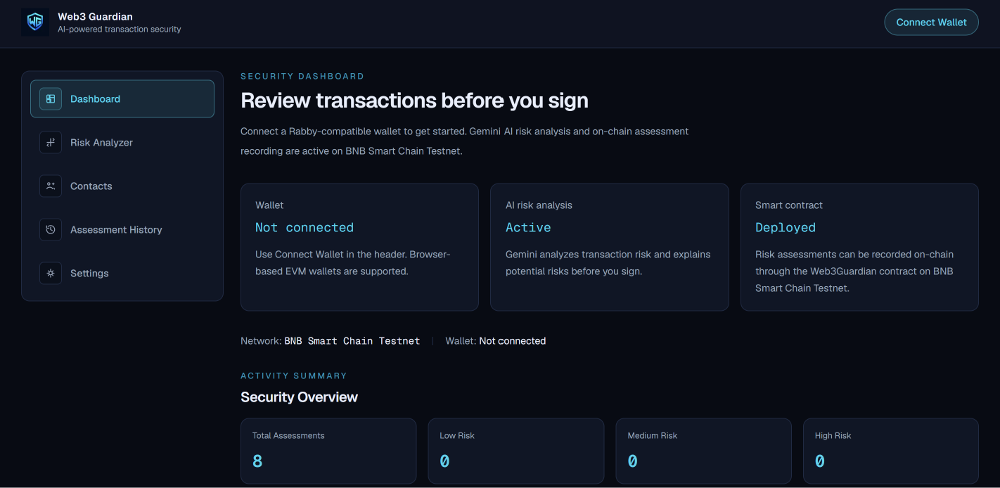
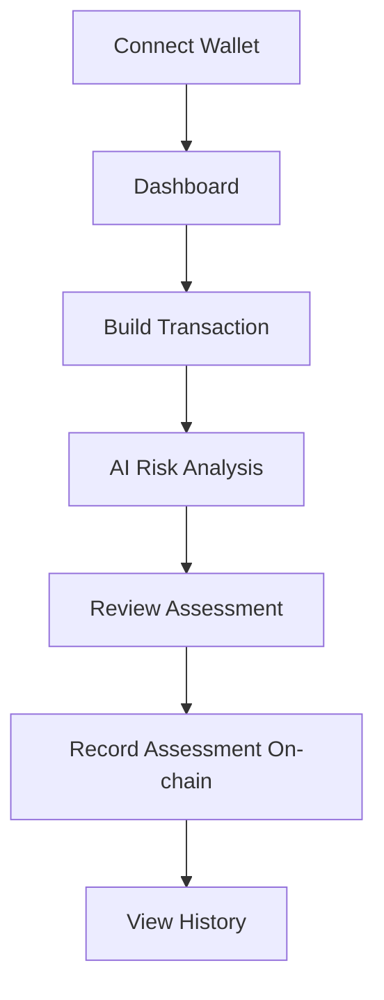
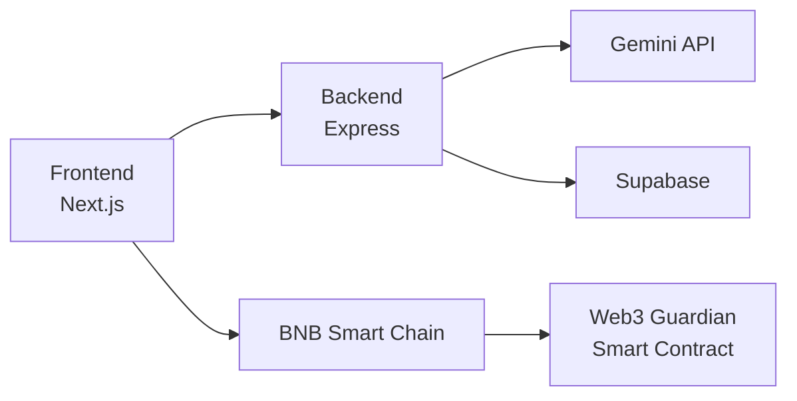

# Web3 Guardian

> AI-powered Web3 transaction risk assessment before you record it on-chain.

Web3 Guardian is an AI-assisted Web3 security application that helps users assess the potential risk of a crypto transaction before recording the assessment on the blockchain.

Users can connect an EVM-compatible browser wallet, build a transaction, receive an AI-powered risk assessment using Gemini, review the result, and record the assessment on the BNB Smart Chain Testnet.

## Problem

Web3 transactions are irreversible once confirmed. Users may interact with an unfamiliar wallet address or make a transaction without fully understanding its potential risks.

Web3 Guardian provides an additional review layer before users proceed with recording their transaction risk assessment on-chain.

## Solution

Web3 Guardian combines:

- EVM wallet connectivity
- AI-assisted transaction risk analysis
- Human review before on-chain recording
- Solidity smart contract
- BNB Smart Chain Testnet
- Assessment history
- Saved wallet contacts

The application is designed as an assessment and awareness tool. AI results are not guaranteed to determine whether a transaction is safe.

## Features

### Wallet Connection

Connect an EVM-compatible browser wallet such as Rabby or another injected wallet.

### AI Risk Analysis

Gemini analyzes transaction information and returns:

- Risk level
- Risk score
- Summary
- Risk findings
- Recommendations

### Transaction Review

Users can review the AI assessment before recording the result on-chain.

### On-chain Assessment

Risk assessments can be recorded through the Web3 Guardian Solidity smart contract on BNB Smart Chain Testnet.

### Assessment History

Previously recorded assessments can be viewed through the History page.

### Wallet Contacts

Users can save frequently used wallet addresses as contacts for easier transaction analysis.

### Security Preferences

Users can configure application preferences such as risk alert thresholds, review requirements, and notifications.

## Live Demo

[**Web3 Guardian — Live Demo**](https://YOUR-VERCEL-DOMAIN.vercel.app)

## Web Preview



## How It Works



## Project Architecture


## Frontend

Built with Next.js App Router, React,  TypeScript, Tailwind CSS, Wagmi, and Viem.

The frontend provides:

- Wallet connection
- Dashboard
- Transaction builder
- AI risk analyzer
- Assessment history
- Contacts
- Settings

## Backend

The backend provides API endpoints for:

- AI assessment data
- Wallet contacts
- Assessment persistence

Supabase is used as the backend database.

## Smart Contract

The Solidity smart contract stores risk assessment records on-chain.

The contract supports:

- Recording assessments
- Retrieving assessments
- Checking whether an assessment has already been recorded

## Tech Stack
| Layer                  | Technology              |
| ---------------------- | ----------------------- |
| Frontend               | Next.js                 |
| UI                     | React + Tailwind CSS    |
| Language               | TypeScript              |
| Wallet                 | Wagmi + Viem            |
| AI                     | Google Gemini API       |
| Backend                | Node.js + Express       |
| Database               | Supabase                |
| Smart Contract         | Solidity                |
| Smart Contract Tooling | Foundry                 |
| Blockchain             | BNB Smart Chain Testnet |
| Version Control        | Git + GitHub            |

## Network

Web3 Guardian currently uses:

BNB Smart Chain Testnet

```bash
Chain ID: 97
```

The application is intended for testing and demonstration purposes.

## Security

The current MVP includes basic security hardening such as:

- Server-side Gemini API key handling
- Environment variables excluded from Git
- Backend request-size limits
- Input validation and length limits
- Risk score and risk level validation
- Assessment ownership checks
- Duplicate assessment protection in the smart contract

## Important limitation

Wallet addresses submitted to the backend are currently treated as request data and are not cryptographically authenticated through wallet signatures.

This is acceptable for the current hackathon MVP but should be improved before production use.

The application should not be considered a guarantee that a transaction is safe.

## Prerequisites
- Node.js
- npm
- Foundry
- An EVM-compatible browser wallet
- Gemini API key
- Supabase project

## Local Development
1. Clone the repository

```bash
git clone https://github.com/davidkhasbiya/web3-guardian.git
cd web3-guardian
```

2. Install frontend dependencies

```bash
cd frontend
npm install
```
Create the frontend environment file:

```bash
frontend/.env.local
```

Configure the required frontend environment variables.

Start the frontend:
```bash
npm run dev
```

The frontend runs at:
```bash
http://localhost:3000
```

3. Start the backend

Open another terminal from the project root:

```bash
cd ~/web3-guardian/backend
npm install
```

Create the backend environment file:

```bash
backend/.env
```

Configure the required backend environment variables.

Start the backend in development mode:

```bash
npm run dev
```

For a production build:
```bash
npm run build
npm start
```

## Smart Contract Development

From the contracts directory:

```bash
cd contracts
forge build
forge test
```

The deployment script is located at:

```bash
contracts/script/Deploy.s.sol
```

## Main Components
**Frontend**
```text
frontend/
├── app/
├── components/
├── lib/
├── public/
└── types/
```

**Backend**
```text
backend/
└── src/
    ├── lib/
    ├── routes/
    └── server.ts
```

**Smart Contract**
```text
contracts/
├── src/
│   └── Web3Guardian.sol
├── script/
│   └── Deploy.s.sol
└── test/
    └── Web3Guardian.t.sol
```

## Limitations

Web3 Guardian is currently a hackathon MVP.

Current limitations include:

- AI analysis is advisory and not a guarantee of transaction safety.
- No full wallet-signature authentication layer for backend requests.
- The application uses BNB Smart Chain Testnet for demonstration.
- No production-grade transaction simulation.
- No formal smart contract security audit.

## Future Improvements

Potential future improvements include:

- Wallet signature authentication
- Transaction simulation before execution
- More on-chain security signals
- Address reputation analysis
- Token contract analysis
- Phishing and scam detection
- Production authentication and rate limiting
- Multi-chain support

## Hackathon

Tracks Indonesia Web3 Hackathon

**Track: AI Agents**

Web3 Guardian demonstrates how AI can be used as an additional safety layer in Web3 transaction workflows.

## License

This project is licensed under the MIT License.

See [LICENSE](LICENSE) for details.